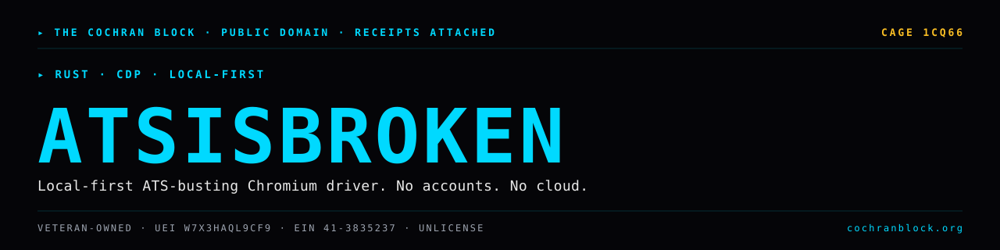

<!-- COCHRANBLOCK-BRAND-HEADER:START - generated by cochranblock/scripts/brand-stamp.sh -->
<picture>
  <source media="(prefers-color-scheme: dark)" srcset="assets/brand/banner.svg">
  <source media="(prefers-color-scheme: light)" srcset="assets/brand/banner.svg">
  
</picture>

[](https://unlicense.org)
[](https://www.rust-lang.org)
[](https://cochranblock.org)
[](https://cochranblock.org)

> &#9656; **RUST** &#183; **CDP** &#183; **LOCAL-FIRST**
<!-- COCHRANBLOCK-BRAND-HEADER:END -->

# atsisbroken

**ATS is broken.** A free, local-first, no-account, no-cloud alternative
to Simplify.us. Single Rust binary that drives Chromium via CDP and
fills job applications using a model **you train locally** from your
own resume.

By **The Cochran Block, LLC**. Public domain — `Unlicense`. Forever.

## Modes

- **Training wheels.** Every fill prompts you for yes/no. Each response
  trains the model online.
- **Chaos.** You graduate when ready. Autonomous fills. Post-hoc flagging
  still trains.

```
$ atsisbroken                       # default: launch the TUI
$ atsisbroken tui                   # same, explicit
$ atsisbroken init                  # paste resume → Profile + seed model
$ atsisbroken status                # current config / first-run hint / detected default browser
$ atsisbroken run                   # auto-pick best fill strategy for env
$ atsisbroken graduate              # TrainingWheels → Shadow → Chaos
$ atsisbroken sync                  # drain feedback queue if delivery configured
$ atsisbroken export --out FILE     # write feedback queue to disk
$ atsisbroken bridge                # Chrome Native Messaging host loop
$ atsisbroken install-bridge --extension-id ID
                                    # write Chrome Native Messaging manifest

# --profile <path> works on every subcommand that touches a profile
# (init / run / status / speak / userscript / bookmarklet / copy).
$ atsisbroken --profile clients/jane.toml init
$ atsisbroken --profile clients/jane.toml run
```

The TUI is the primary interface — running with no subcommand opens a
three-tab terminal app (dashboard / queue / strategy) modeled on the
Claude Code aesthetic. Subcommands are for scripting and one-shot
tasks.

When CDP isn't available, `run` falls through a strategy ladder so the
product is usable in every environment:

```
$ atsisbroken userscript            # output a TamperMonkey userscript
$ atsisbroken bookmarklet           # output a javascript: bookmarklet
$ atsisbroken copy email            # copy a single field to the clipboard
$ atsisbroken speak                 # print every populated field
$ atsisbroken cdp-probe             # diagnose Chromium debug port
```

## Build

```sh
cargo build                                              # dev
cargo build --profile=diamond                            # speed-Diamond
cargo build --profile=diamond-edge --target=<triple>     # release
```

## Verify

```sh
cargo test
```

For the exopack TRIPLE SIMS determinism gate, see [`PROOF_OF_ARTIFACTS.md`](PROOF_OF_ARTIFACTS.md).

## Docs

Top-level (Cochran Block convention):
- [`README.md`](README.md)
- [`PLAN.md`](PLAN.md) — engineering + distribution + narrative + interested-parties
- [`USER_STORY_ANALYSIS.md`](USER_STORY_ANALYSIS.md)
- [`TIMELINE_OF_INVENTION.md`](TIMELINE_OF_INVENTION.md)
- [`PROOF_OF_ARTIFACTS.md`](PROOF_OF_ARTIFACTS.md)
- [`BACKLOG.md`](BACKLOG.md)
- [`CONTRIBUTORS.md`](CONTRIBUTORS.md)
- [`LICENSE-PROVENANCE.md`](LICENSE-PROVENANCE.md)
- [`UNLICENSE`](UNLICENSE)

Topic-specific (in `docs/`):
- [`docs/USER_FLOW.md`](docs/USER_FLOW.md) — install → first fill → graduation → chaos
- [`docs/UI_UX_ANALYSIS.md`](docs/UI_UX_ANALYSIS.md) — visual hierarchy, accessibility, gaps & recs
- [`docs/UI_UX_SIMULATION.md`](docs/UI_UX_SIMULATION.md) — persona × environment walkthroughs (P1–P7, E1–E6)
- [`docs/PLAN_BROWSER_AUTOMATION.md`](docs/PLAN_BROWSER_AUTOMATION.md) — TUI → launch browser → navigate → autofill, plus install-when-missing
- [`docs/PLAN_PROFILE_AND_GITHUB.md`](docs/PLAN_PROFILE_AND_GITHUB.md) — expanded ~75-field schema + GitHub inventory + Blog inventory (RSS / Atom / sitemap discovery) + verbatim-source free-form answers (per-source citation: repo+commit_sha for GitHub, URL+date for Blog) + user-defined regex hooks across any source
- [`docs/ATS_FIXTURE_SOURCES.md`](docs/ATS_FIXTURE_SOURCES.md) — sources for the 5 vendor fixture renderers (Greenhouse / Lever / Workday / iCIMS / Ashby), with author attribution
- [`docs/PERFECTION_PLAN.md`](docs/PERFECTION_PLAN.md) — research-driven path to 1.0 (vendor census → DOM capture → accuracy benchmark → trained classifier → multi-page Workday → anti-bot → legal → interviews → beta)
- [`docs/research/ATS_MARKET_SHARE_2026Q2.md`](docs/research/ATS_MARKET_SHARE_2026Q2.md) — R1 results. Ashby 49% / Greenhouse 30% / Workday 0.9% in HN-startup cohort (HN-biased; broader sample needed)
- [`docs/HIRING_MANAGER_ANALYSIS.md`](docs/HIRING_MANAGER_ANALYSIS.md) — HM personas + AI-detection heuristics + "explainability" property
- [`docs/WHY_NO_ONE_IS_BUILDING_THIS.md`](docs/WHY_NO_ONE_IS_BUILDING_THIS.md) — honest market analysis: SaaS LTV inversion, engineering cost, Cochran Block's unfair advantage
- [`docs/TRAINING_DATA.md`](docs/TRAINING_DATA.md) — responsibly-sourced data tiers

Sub-product READMEs:
- [`extension/README.md`](extension/README.md) — Chrome extension + Native Messaging bridge
- [`android/README.md`](android/README.md) — Kotlin WebView shell + Rust JNI core
<!-- COCHRANBLOCK-BRAND-FOOTER:START - generated by cochranblock/scripts/brand-stamp.sh -->

---

<sub>&#9656; **THE COCHRAN BLOCK, LLC** &#183; Veteran-Owned &#183; **CAGE** `1CQ66` &#183; **UEI** `W7X3HAQL9CF9` &#183; **EIN** `41-3835237`</sub>

<sub>&#9656; PUBLIC DOMAIN &#183; UNLICENSE &#183; RECEIPTS ATTACHED &#183; [**cochranblock.org**](https://cochranblock.org) &#183; [github.com/cochranblock](https://github.com/cochranblock)</sub>
<!-- COCHRANBLOCK-BRAND-FOOTER:END -->
