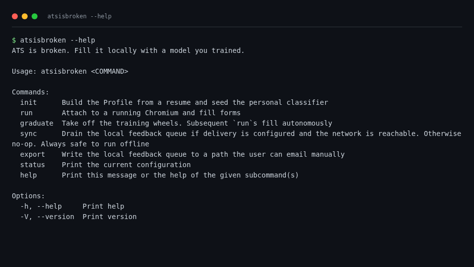
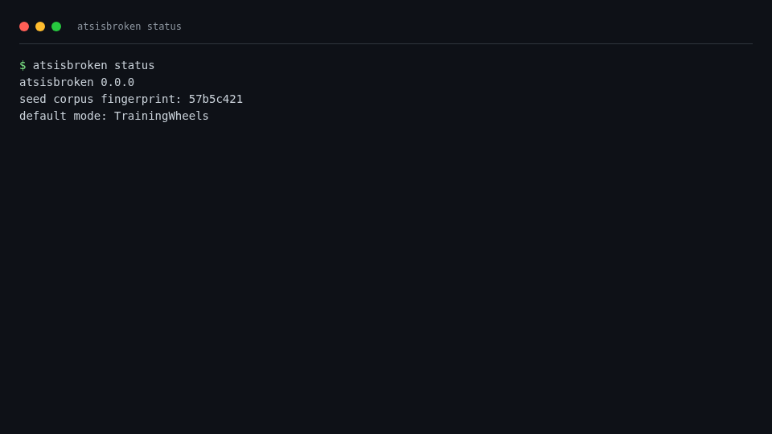
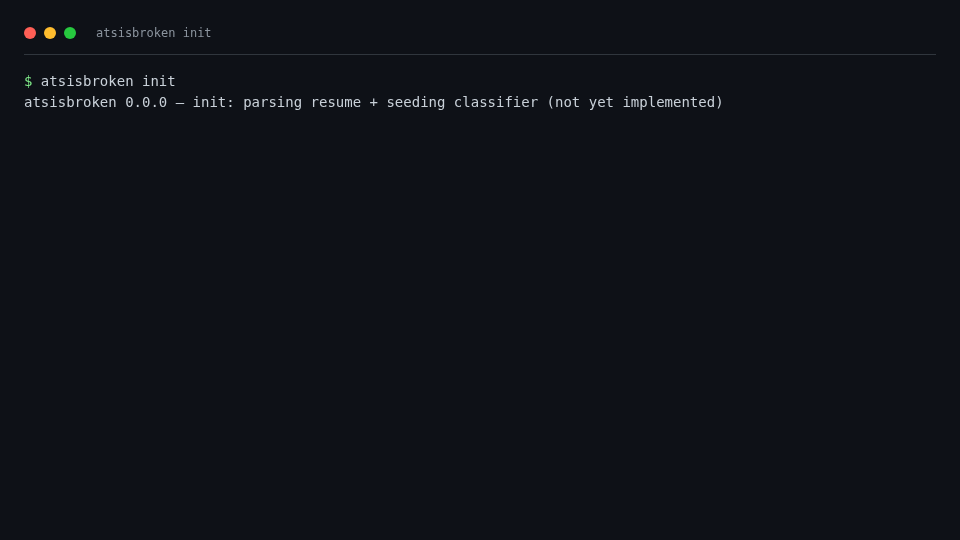
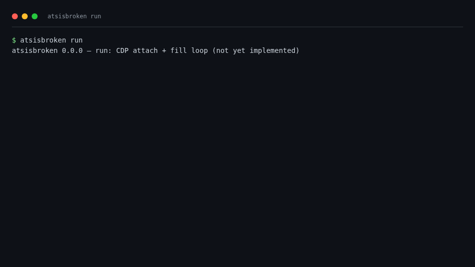
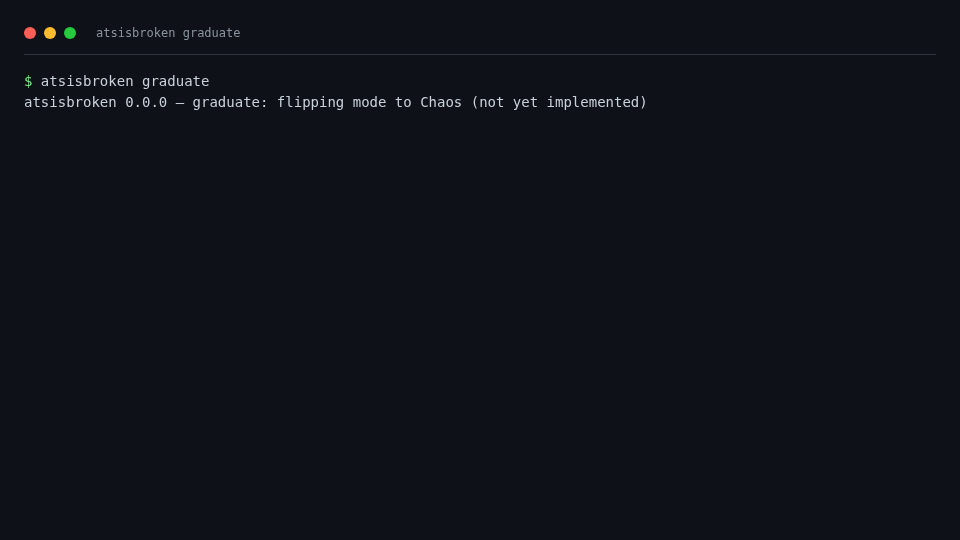
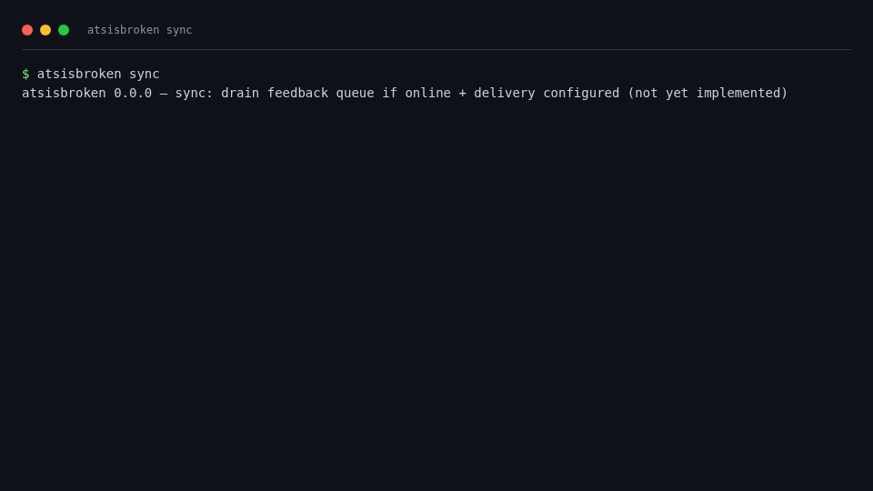

# atsisbroken — UI/UX Simulation

Screenshots auto-captured via `scripts/capture-screenshots.sh` (headless
Chromium → PNG). Source-of-truth: `docs/screenshots/*.png`.

## Captured surfaces

| # | Subcommand | Screenshot |
|---|---|---|
| 01 | `atsisbroken --help` |  |
| 02 | `atsisbroken status` |  |
| 03 | `atsisbroken init` |  |
| 04 | `atsisbroken run` |  |
| 05 | `atsisbroken graduate` |  |
| 06 | `atsisbroken sync` |  |

## Findings (as of this commit)

### Pass
- Help (01) lists all subcommands with one-line descriptions. Subcommand
  vocabulary maps cleanly to user mental model: init → run → graduate.
- Stub commands (03–06) explicitly print `(not yet implemented)` —
  no false-positive UX, no silent no-op confusion.
- Status (02) shows the seed corpus fingerprint — gives the privacy-
  hawk persona (P2) a one-line audit anchor.

### Fail
- **Status doesn't detect first run.** P1 / P3 will run `status` first
  and see only `default mode: TrainingWheels` with no hint that
  `init` is the next step. Fix: status should check for
  `~/.atsisbroken/profile.toml` and print `(not initialized — run
  'atsisbroken init')` when missing.
- **`graduate` lacks a confirmation prompt.** It's a one-way switch
  from supervised → autonomous. P4 (career counselor) running it by
  accident on a fresh profile is a footgun. Fix: prompt
  `Are you sure? [y/N]` unless `--yes` is passed.
- **`sync` says "(not yet implemented)" but should distinguish
  three states once wired:** offline / no-destination-configured /
  drained-N-events. Spec the messaging now.
- **No color on output.** Help text could use one accent color for
  subcommand names; status could use green/red for "ready/not-ready".
  Low effort, big readability win.
- **Status doesn't show feedback queue depth.** Once the queue exists,
  it should appear in status: `feedback queue: 12 events pending`.

### P0 follow-ups
1. `status` first-run detection (~10 LOC).
2. `graduate` confirmation prompt (~5 LOC).
3. `sync` three-state messaging spec.
4. Status surfaces feedback queue depth once queue lands on disk.

## Reproduction

```sh
cargo build
./scripts/capture-screenshots.sh
```

Outputs 6 PNGs to `docs/screenshots/`. Deterministic across runs.
