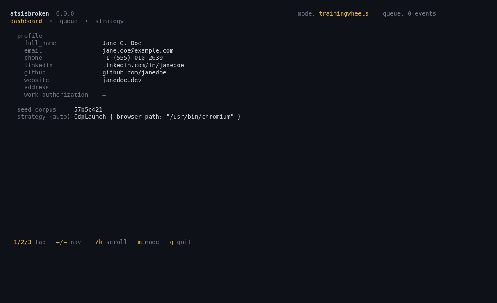
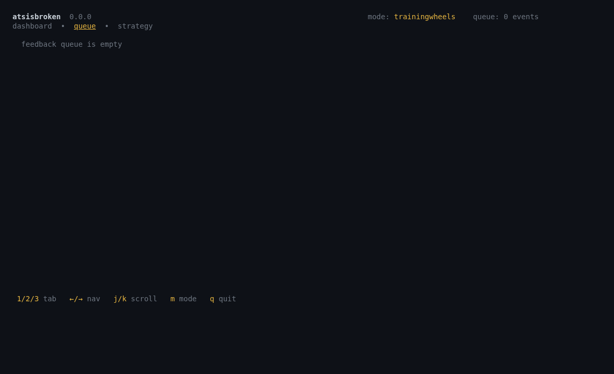
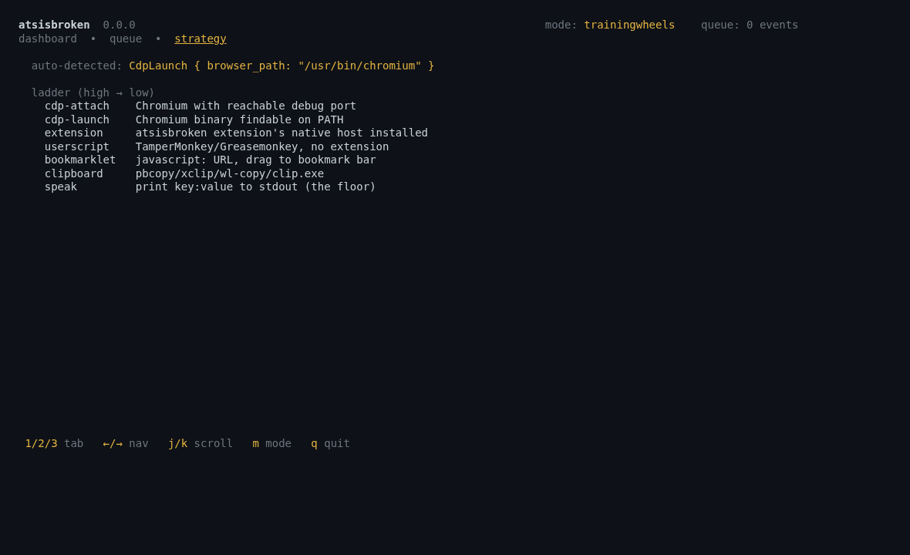
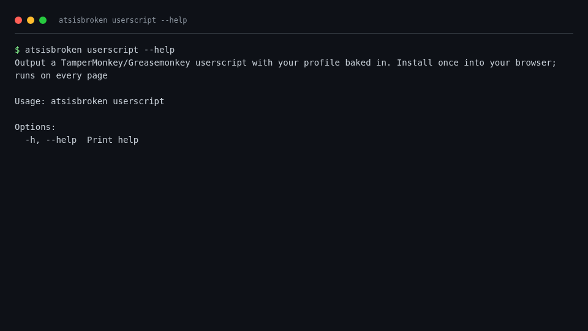
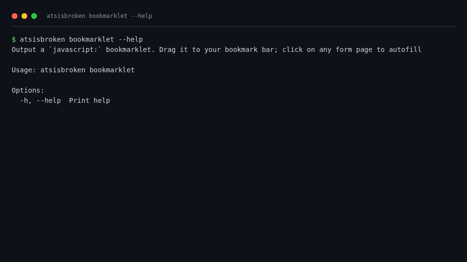
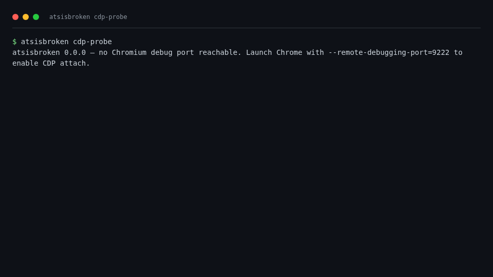
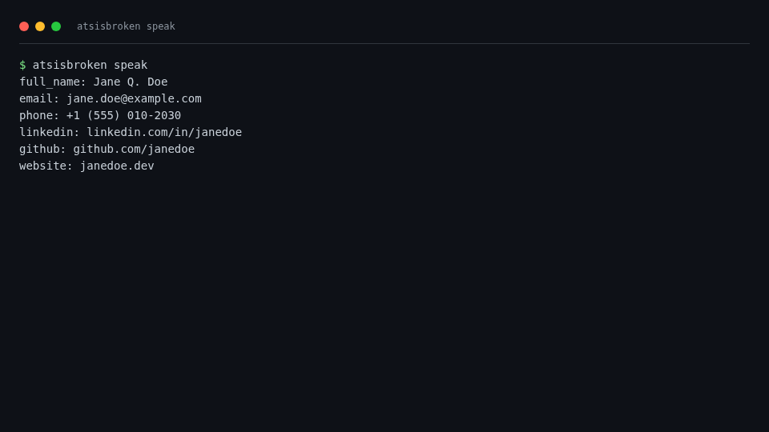

# atsisbroken — UI/UX Simulation

Auto-captured via `scripts/capture-screenshots.sh` (CLI output → styled
HTML → headless Chromium → PNG, plus TUI output → ratatui `TestBackend`
buffer → styled HTML → headless Chromium → PNG). Source-of-truth:
`docs/screenshots/*.png`.

## TUI surfaces (default interface)

`atsisbroken` with no subcommand drops into the TUI. Three tabs.

| # | Tab | Screenshot |
|---|---|---|
| 1 | dashboard |  |
| 2 | queue     |  |
| 3 | strategy  |  |

Aesthetic: minimal borders, mostly text, dim status footer with keybind
hints. Modeled on Claude Code so anyone fluent in that tool's
conventions feels at home immediately.

## CLI surfaces (scripting / one-shot)

| # | Subcommand | Screenshot |
|---|---|---|
| 01 | `atsisbroken --help` |  |
| 02 | `atsisbroken status` |  |
| 03 | `atsisbroken userscript --help` |  |
| 04 | `atsisbroken bookmarklet --help` |  |
| 05 | `atsisbroken cdp-probe` |  |
| 06 | `atsisbroken speak` |  |

## Findings

### Pass
- TUI dashboard surfaces every populated profile field plus seed
  corpus fingerprint and the auto-detected strategy in one screen.
- Strategy tab makes the fall-through ladder legible at a glance.
- Footer keybind hints (`1/2/3 tab  ←/→ nav  j/k scroll  m mode  q quit`)
  match Claude Code conventions — vim-style + arrow + digit navigation.
- Empty-profile case shows `not initialized — run \`atsisbroken init\``
  in accent color rather than blank space.
- `status` (CLI) reflects initialized/uninitialized + queue depth +
  profile path, satisfying the first-run hint that the original UX
  sim flagged.

### Fail
- TUI **mode toggle is local-only** — pressing `m` cycles the
  in-memory mode but doesn't persist to `~/.atsisbroken/config.toml`
  yet. Visible-only, no effect on next run.
- TUI **doesn't surface `Mode::Shadow`'s confidence threshold** or
  per-key promotion state. Should appear in the dashboard once the
  trainer is wired.
- Queue tab has no filtering (all events shown). At >100 events,
  needs a search input or accepted/rejected filter.

### P0 follow-ups
1. Persist mode changes on `m` key (write `config.toml`).
2. Surface confidence-threshold + per-key promoted-or-not in
   dashboard, once the classifier exists.
3. Queue-tab search/filter at >100 events.

## Reproduction

```sh
cargo build
./scripts/capture-screenshots.sh
```

Outputs 9 PNGs to `docs/screenshots/`. CLI shots are deterministic;
TUI shots depend on the user's `~/.atsisbroken/profile.toml` content.
